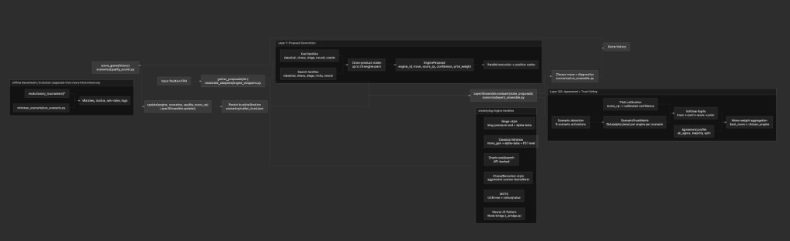
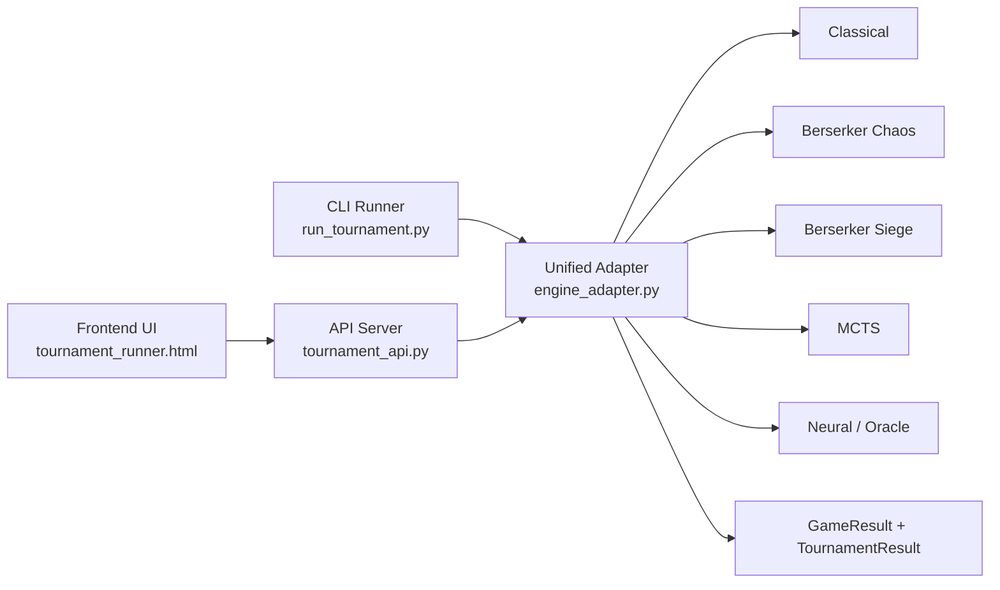
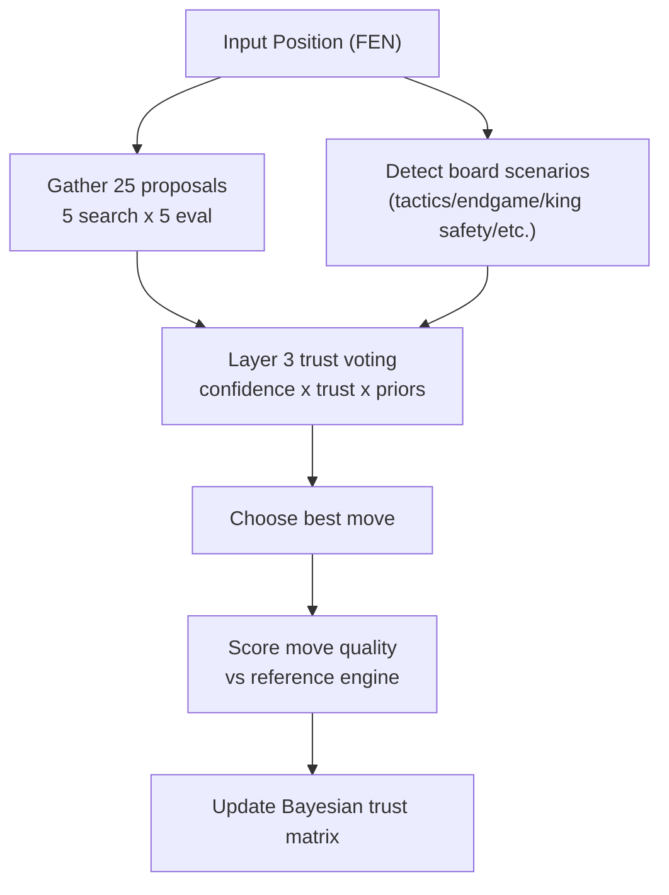

# CubistChessEngine

CubistChessEngine is a modular chess AI platform built for experimentation, comparison, and ensemble learning across multiple engine styles. Instead of a single monolithic engine, this project combines classical search, tactical variants, Monte Carlo search, neural/mock components, and optional LLM-assisted evaluation behind a unified adapter and tournament stack.

## Why this project exists

The project explores a core question:

How do we combine different chess "personalities" (deep positional search, tactical aggression, stochastic exploration, learned components) into one system that can adapt per position?

To answer that, CubistChessEngine provides:

- A unified engine adapter layer
- Tournament and API infrastructure
- A 25-node ensemble proposal grid
- A Bayesian trust matrix that learns which engine style to trust by scenario

---

## High-level architecture

At a high level, the codebase is split into:

- `adapter_code/`  
  Unified runtime adapter, game runner, API server, and frontend UI.
- `classical_minimax/`  
  Classical alpha-beta/minimax style engine path.
- `berserker1/`, `berserker_2/`  
  Tactical/aggressive engine variants.
- `monte_carlo/`  
  MCTS-based search path.
- `ensemble_adapters/` + `scenarios/`  
  Layered ensemble orchestration, trust learning, quality scoring, and scenario experiments.
- `evolutionary_tournament/`  
  Weight tuning/evolution and evaluation harness.
- `tdleaf_nnue_engine/`  
  Separate TD-Leaf/NNUE experimentation track with training artifacts and benchmarks.

## System flow visual

Reference architecture screenshot:





---

## Core runtime flow

For standard game/tournament execution:

1. Build engine adapters with `build_engine(...)` or `build_combo(...)`
2. Run games through `GameRunner.play(...)`
3. Validate every move centrally
4. End on terminal conditions (mate/stalemate/repetition/50-move/max-moves/illegal-move forfeit)
5. Aggregate in `run_tournament(...)`

Main implementation: `adapter_code/engine_adapter.py`

For browser/API usage:

- `adapter_code/tournament_api.py` exposes local endpoints
- `adapter_code/tournament_runner.html` calls API and visualizes games/results

---

## Ensemble learning flow

Main ensemble path:

- `ensemble_adapters/engine_wrappers.py` gathers proposal moves from a 5x5 search/eval matrix (25 nodes)
- `scenarios/layer3_ensemble.py` computes scenario activations and trust-weighted voting
- `scenarios/quality_scorer.py` scores move quality and updates trust cells over time
- `scenarios/run_ensemble.py` provides single-position and self-play demos

This enables position-conditioned decision making:
the system can trust different engine families more in tactical chaos vs. endgame structure, etc.

### Ensemble decision visual



---

## Setup

From repository root:

```bash
python -m venv .venv
source .venv/bin/activate
pip install -r requirements.txt
```

### Optional dependencies

- `node` for neural/mock JS bridge paths
- `ANTHROPIC_API_KEY` for oracle/LLM evaluation modes
- `STOCKFISH_EXECUTABLE` for stronger reference evaluation in some scenarios

---

## Quick start commands

### 1) Run baseline round-robin tournament

```bash
python run_tournament.py
```

### 2) Start local API backend

```bash
cd adapter_code
python tournament_api.py --host 127.0.0.1 --port 8765
```

### 3) Launch frontend UI

Open:

`adapter_code/tournament_runner.html`

The UI defaults to backend base URL:

`http://127.0.0.1:8765`

### 4) Run ensemble single-position demo

```bash
python scenarios/run_ensemble.py --explain
```

### 5) Run ensemble self-play (with trust updates)

```bash
python scenarios/run_ensemble.py --selfplay --moves 30
```

---

## Evolutionary tournament (Scenario 6)

From repo root, after installing `requirements.txt`:

```bash
python -m evolutionary_tournament
python -m evolutionary_tournament --evolve
```

To point the reference at a local Stockfish binary:

macOS/Linux:

```bash
export STOCKFISH_EXECUTABLE=/path/to/stockfish
```

Windows (PowerShell):

```powershell
$env:STOCKFISH_EXECUTABLE="C:\path\to\stockfish.exe"
```

If unset, the harness falls back to a built-in evaluator.

---

## Notable project strengths

- **Modular architecture:** swap/compare engine styles quickly
- **Unified interface:** common adapter and move validation
- **Scenario-aware ensemble:** trust matrix learns per position type
- **Explainability hooks:** diagnostics for proposals, trust, and voting
- **Multiple demo surfaces:** CLI tournament, API, UI, notebooks

---

## Known limitations and caveats

- Some components are research-grade and may need environment-specific setup
- Oracle/LLM paths require API credentials and can be slower
- Parallel speedups are bounded for pure-Python workloads (GIL), though caching and I/O overlap help
- Reference-based quality scoring is useful but not equivalent to full Elo calibration

---

## Suggested demo script (hackathon-friendly)

1. Run `python run_tournament.py` to show multi-engine competition
2. Run `python scenarios/run_ensemble.py --fen "<position>" --explain` to show explainable decisioning
3. Run `python scenarios/run_ensemble.py --selfplay --moves 20` to show trust updates over a game
4. Open the UI to show interactive integration and accessibility

---

## Project status

This repository is an active experimental system with multiple engine tracks and scenario harnesses. It is designed for rapid iteration, comparative AI experimentation, and demonstration of ensemble orchestration concepts in chess.
